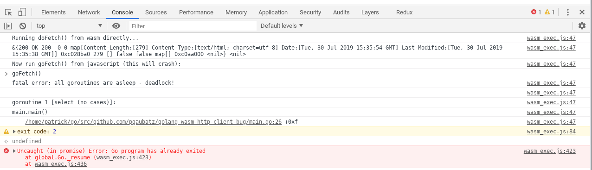

# golang-wasm-http-client-bug

How to run:

```
$ make
cp /usr/local/go/misc/wasm/wasm_exec.js .
GOARCH=wasm GOOS=js go build -o main.wasm main.go

$ make run
go run server.go
```

Open http://localhost:8181/index.htm and toggle your Web browser's DevTools.

You should see something like this:

